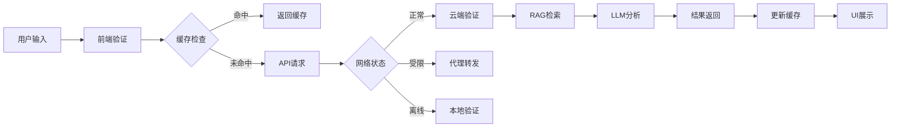

# 小查馆（Xiao Cha Guan）项目架构设计文档

## 项目概述

小查馆是一个面向中国大陆用户的多语种事实核查浏览器插件和配套网站平台，旨在帮助用户识别和验证社交媒体上的误导性信息。

## 用户旅程设计

### 1. 典型用户场景

#### 场景A：被动检测（日常浏览）
```
用户浏览微博 → 插件自动检测可疑内容 → 高亮显示 → 悬停查看快速结果 → 点击查看详细证据
```

#### 场景B：主动查询（有疑问时）
```
看到可疑信息 → 选中文本 → 右键验证 → 显示验证进度 → 展示多源结果
```

#### 场景C：离线模式（网络受限）
```
检测网络受限 → 自动切换本地模式 → 使用缓存数据 → 标记可能过时 → 网络恢复后更新
```

#### 场景D：跨语言验证
```
检测翻译内容 → 自动查找原文 → 对比差异 → 标注误译部分
```

## Chrome Extension 架构

### 核心组件结构

```
xiaochaguan-extension/
├── manifest.json              # 扩展配置
├── background.ts              # Service Worker - 后台逻辑
├── contents/
│   └── analyzer.ts           # Content Script - 页面分析
├── popup.svelte              # Popup UI - 主界面
├── components/
│   ├── QuickVerify.svelte   # 快速验证组件
│   ├── RecentChecks.svelte  # 最近检查
│   ├── Statistics.svelte    # 统计面板
│   ├── Settings.svelte      # 设置页面
│   └── ConnectionStatus.svelte # 连接状态
├── lib/
│   ├── network/
│   │   ├── connection-manager.ts  # 连接管理（GFW规避）
│   │   ├── shadowsocks-client.ts  # Shadowsocks客户端
│   │   └── cdn-proxy.ts          # CDN代理
│   ├── services/
│   │   ├── fact-check-service.ts # 事实核查服务
│   │   └── translation-service.ts # 翻译服务
│   ├── nlp/
│   │   ├── claim-detector.ts     # 声明检测
│   │   └── language-detector.ts  # 语言检测
│   ├── cache/
│   │   ├── cache-manager.ts      # 缓存管理
│   │   └── indexed-db.ts         # 本地数据库
│   └── ui/
│       ├── content-ui.ts         # 页面UI渲染
│       └── notification.ts       # 通知系统
└── assets/
    ├── icons/                     # 图标资源
    └── styles/                    # 样式文件
```

### 技术栈

- **框架**: Svelte + Plasmo Framework
- **语言**: TypeScript
- **样式**: Tailwind CSS
- **存储**: IndexedDB (Dexie.js)
- **网络**: WebExtension API + 自定义代理层
- **AI/NLP**: Claude/GPT-4 API + 本地模型

### 关键功能模块

#### 1. 自动检测系统
- 页面加载时扫描内容
- MutationObserver监听动态内容
- 智能识别可验证声明
- 根据置信度分级标记

#### 2. 网络连接管理
```typescript
// 连接优先级
1. 直连（境外用户）
2. Shadowsocks (主要)
3. VMess (备用)
4. Tor + Snowflake (最后手段)
5. 本地缓存（离线模式）
```

#### 3. 验证流程
```typescript
声明检测 → 语言识别 → 缓存查询 → 
网络验证 → RAG检索 → LLM分析 → 
结果展示 → 缓存存储
```

#### 4. UI交互设计
- **高亮标记**: 根据风险等级显示不同颜色
- **快速卡片**: 悬停显示简要信息
- **详细面板**: 点击查看完整验证结果
- **快速操作**: 选中文本后的浮动按钮

## 主网站架构

### 技术栈

- **前端**: React + TypeScript
- **样式**: CSS Modules + CSS Variables
- **状态管理**: React Context + Hooks
- **API通信**: Fetch API + WebSocket
- **部署**: Cloudflare Pages / Vercel

### 页面结构

```
xiaochaguan.app/
├── 首页
│   ├── Hero区域 - 品牌展示
│   ├── 搜索栏 - 快速验证入口
│   ├── 功能展示 - 四大核心功能
│   ├── 热门验证 - 实时热点
│   ├── 统计数据 - 平台数据
│   └── 工作原理 - 四步流程
├── 验证页面
│   ├── 输入区域
│   ├── 验证进度
│   ├── 结果展示
│   └── 证据列表
├── 浏览器插件页
│   ├── 安装指南
│   ├── 功能介绍
│   └── 下载链接
├── API文档
│   ├── 接口说明
│   ├── 认证方式
│   └── 示例代码
└── 关于我们
    ├── 项目介绍
    ├── 团队信息
    └── 联系方式
```

### 核心功能

#### 1. 实时验证
- WebSocket连接状态更新
- 流式返回验证结果
- 进度条显示
- 中断/取消功能

#### 2. 多语言支持
```typescript
interface LanguageConfig {
  'zh-CN': '简体中文',
  'zh-TW': '繁體中文',
  'en': 'English',
  'ja': '日本語',
  'ko': '한국어'
}
```

#### 3. 响应式设计
- 移动优先
- 断点: 640px, 768px, 1024px, 1280px
- PWA支持（离线访问）

#### 4. 性能优化
- 代码分割（React.lazy）
- 图片懒加载
- Service Worker缓存
- CDN加速

## 数据流设计

### 验证请求流程



### 状态管理

```typescript
interface AppState {
  user: UserState
  verification: VerificationState
  network: NetworkState
  settings: SettingsState
  cache: CacheState
}

interface VerificationState {
  isVerifying: boolean
  currentClaim: Claim | null
  results: VerificationResult[]
  history: HistoryItem[]
}
```

## 安全与隐私

### 数据保护
1. **本地优先**: 敏感数据不上传
2. **端到端加密**: API通信加密
3. **最小权限**: 仅请求必要权限
4. **匿名化**: 不收集个人身份信息

### 网络安全
1. **多层代理**: Shadowsocks + VMess + Tor
2. **流量混淆**: 伪装为HTTPS流量
3. **自动切换**: 检测封锁自动切换线路
4. **本地缓存**: 减少网络请求

## 部署策略

### Chrome Extension
1. Chrome Web Store (境外)
2. GitHub Releases (直接下载)
3. 自托管更新服务器

### 主网站
1. **主域名**: xiaochaguan.app (Cloudflare)
2. **备用域名**: 多个备用域名
3. **CDN**: Cloudflare CDN
4. **镜像站点**: IPFS托管

### API服务
1. **主服务器**: AWS/GCP (境外)
2. **边缘节点**: Cloudflare Workers
3. **备用通道**: WebRTC数据通道

## 开发路线图

### Phase 1: MVP (4-6周)
- [x] 基础插件框架
- [x] 简单文本验证
- [x] 本地缓存
- [ ] 基础UI

### Phase 2: 核心功能 (6-8周)
- [ ] LLM集成
- [ ] 多源验证
- [ ] 中文NLP优化
- [ ] 跨浏览器支持

### Phase 3: 网络优化 (8-10周)
- [ ] Shadowsocks集成
- [ ] 自动故障转移
- [ ] CDN代理
- [ ] 离线模式

### Phase 4: 高级功能 (8-10周)
- [ ] 实时监控
- [ ] 跨语言验证
- [ ] 社交分享
- [ ] 协作验证

### Phase 5: 优化扩展 (4-6周)
- [ ] 性能优化
- [ ] A/B测试
- [ ] 国际化
- [ ] 安全审计

## 成功指标

### 技术指标
- 验证准确率 > 85%
- 响应时间 < 3秒
- 缓存命中率 > 60%
- 连接成功率 > 95%

### 用户指标
- 日活用户 > 10K
- 留存率 > 40%
- 满意度 > 4.5/5
- 月验证量 > 100K

## 风险与应对

### 技术风险
| 风险 | 影响 | 应对措施 |
|-----|------|---------|
| GFW升级 | 高 | 多协议支持，快速更新 |
| LLM限流 | 中 | 多模型切换，本地缓存 |
| 性能瓶颈 | 中 | 分布式架构，边缘计算 |

### 法律风险
- 明确服务条款
- 用户风险提示
- 境外运营主体
- 合规性审查

### 运营风险
- 开源社区支持
- 多渠道分发
- 用户教育
- 持续迭代

## 总结

小查馆项目通过技术创新和用户体验优化，为中国大陆用户提供可靠的事实核查服务。核心优势包括：

1. **技术领先**: LLM+RAG混合架构，准确率高
2. **网络突破**: 多层规避策略，稳定可靠
3. **用户友好**: 简洁界面，一键验证
4. **隐私保护**: 本地优先，数据安全

项目成功的关键在于持续的技术迭代、社区支持和对用户需求的深入理解。
